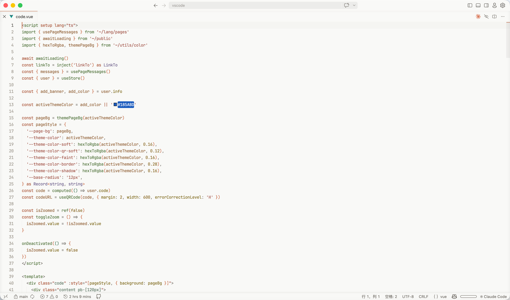
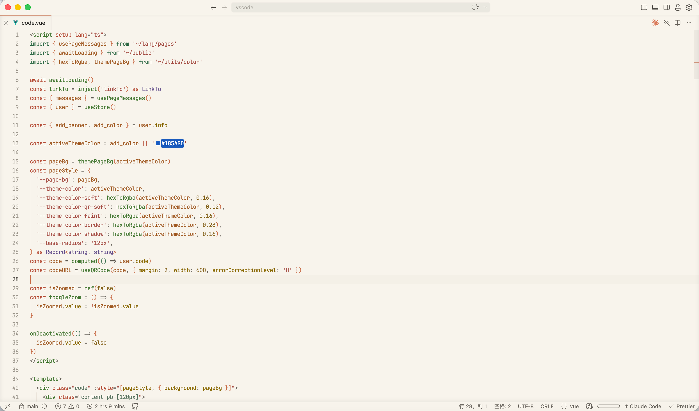
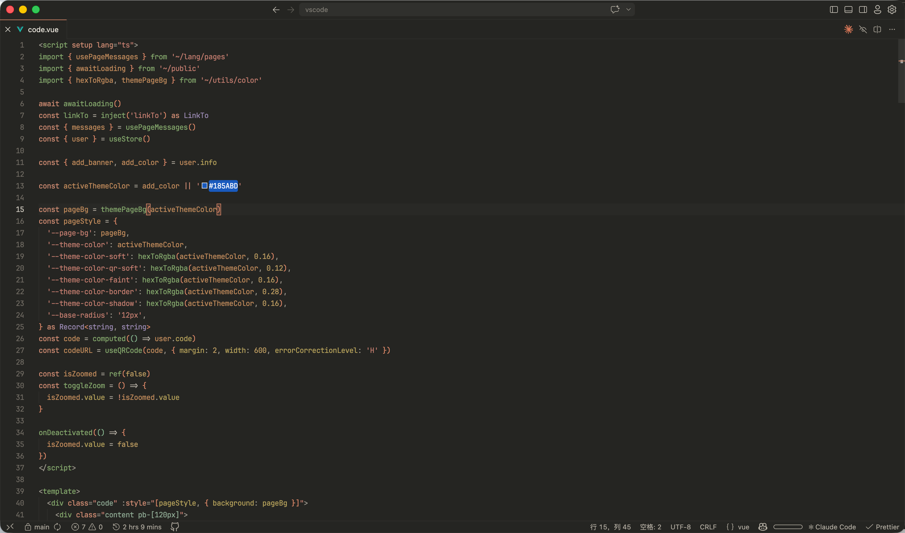

# Absolutely Theme

A warm, calm, and minimalist color theme family for Visual Studio Code, inspired by the cozy and natural Absolutely palette.

Designed with carefully selected low-contrast tones to reduce eye strain, Absolutely Theme provides a peaceful and focused workspace for long coding and writing sessions.

[](https://marketplace.visualstudio.com/items?itemName=yulin96.vscode-absolutely-theme)
[](https://marketplace.visualstudio.com/items?itemName=yulin96.vscode-absolutely-theme)
[](https://marketplace.visualstudio.com/items?itemName=yulin96.vscode-absolutely-theme)
[](https://github.com/yulin96/vscode-absolutely-theme/blob/main/LICENSE)

---

## 🎨 Theme Variants

Absolutely Theme features three carefully balanced variants, tailored for different lighting conditions and styles:

| Variant | Type | Description | Background | Accent |
| :--- | :--- | :--- | :---: | :---: |
| **Absolutely Light** | Light | A clean, soft light theme designed for bright rooms without harsh glares. | `#F9F9F7` | `#CC7D5E` |
| **Absolutely Light Warm** | Light | A cozy, warm-toned light theme resembling physical book paper. | `#F7F4EC` | `#CC7D5E` |
| **Absolutely Dark** | Dark | A dark theme with muted tones and low contrast to soothe the eyes at night. | `#252522` | `#D98666` |

---

## 📸 Previews

### ☀️ Absolutely Light


### 🌾 Absolutely Light Warm


### 🌙 Absolutely Dark


---

## 🚀 Installation

1. Open **Visual Studio Code**.
2. Open the **Extensions** panel (`Ctrl+Shift+X` or `Cmd+Shift+X`).
3. Search for **`Absolutely Theme`**.
4. Click **Install**.
5. Press `Ctrl+K Ctrl+T` (or `Cmd+K Cmd+T` on macOS) and select your preferred variant from the dropdown menu.

---

## 🛠 Customization & Tips

### Enable Semantic Highlighting
For the best visual experience, make sure semantic highlighting is enabled in your settings:
```json
"editor.semanticHighlighting.enabled": true
```

### Font Recommendations
This theme pairs beautifully with clean monospaced fonts that support ligatures. We recommend:
- [Fira Code](https://github.com/tonsky/FiraCode)
- [JetBrains Mono](https://www.jetbrains.com/lp/mono/)
- [Operator Mono](https://www.typography.com/fonts/operator/styles)

Add this to your `settings.json` for a modern, distraction-free aesthetic:
```json
{
  "editor.lineHeight": 1.6,
  "editor.fontSize": 14,
  "editor.minimap.enabled": false,
  "editor.scrollbar.horizontal": "hidden",
  "workbench.startupEditor": "none"
}
```

### Override Colors
Want to tweak the background or another specific color? You can override any theme color in your user settings:
```json
"workbench.colorCustomizations": {
  "[Absolutely Dark]": {
    "editor.background": "#1E1E1C"
  }
}
```

---

## 📄 License & Credits

This project is licensed under the [MIT License](LICENSE).

Developed and designed with ❤️ by [yulin96](https://github.com/yulin96).
